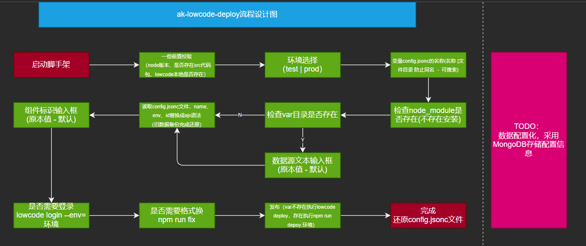

### 前期准备

1. 代码规范(eslint | prettier) [tsLint](https://typescript-eslint.io/docs/linting/)

2. 使用 TypeScript [TSC CI 编译](https://juejin.cn/post/6844904093568221191)

3. 使用 learn 进行多包管理

4. 提交工程化 (commitlint | husky | lint-stage)

5. ts-node 执行 ts 脚本

6. 使用 tsconfig 下 references

7. yarn2 管理 - 强制 yarn [参考文献](https://yarnpkg.com/configuration/yarnrc#npmRegistries)

8. shell [指南](https://mp.weixin.qq.com/s/YWLFoOEWyenFR6LQfqxA_g)

### TODO

1. Tslint 未完成

### 组件发布脚手架需求

